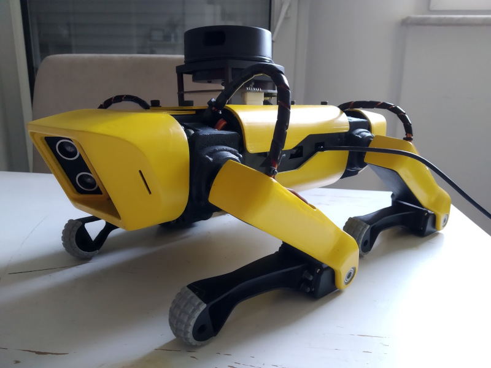
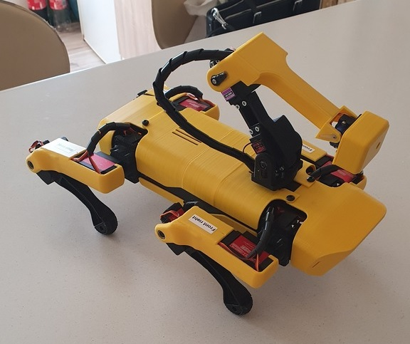

# SpotMicroAI

## The Story
The SpotMicro model was originally developed by **[Deok-yeon Kim](https://www.thingiverse.com/KDY0523/about)** and released on [Thingiverse](https://www.thingiverse.com/thing:3445283). He has posted that he is required to join the military in his country for two years and so will be absent from development.

## The Community
The community has grown since then and different builds are available for everyone.

If you are eager to build your own, you can start joining us in slack: [spotmicroai-inviter.herokuapp.com/](https://spotmicroai-inviter.herokuapp.com/), we are very active in Slack. Or you can join the message board: [http://spotmicro.org](http://spotmicro.org)

## The Build
This is a reasonably priced quadruped.

Before you start you need to decide if you want to have:

* A fully simulated quadruped robot (pyBullet / ROS), **[Simulation build](https://gitlab.com/custom_robots/spotmicroai/simulation)**, this page contains the information to drive you through it.
* A simple quadruped robot controlled with remote bluetooth controller (PS4 or XBOX for example), **[Basic build](https://gitlab.com/custom_robots/spotmicroai/basic)**, the repository will guide you.

> Lidar build by @FlorianWilk

> Remote controlled with ARM by @Knosterpitter

## Where to start

You have all the repositories in GitLab
* [SpotMicroAI](https://gitlab.com/custom_robots/spotmicroai)
* [Slack](https://spotmicroai-inviter.herokuapp.com/)

## 3d Prints

* All [3D print models](https://gitlab.com/custom_robots/spotmicroai/3dprint) are available in the repo
 * Because the performance issues with Thingiverse site, we have saved some users parts there (with the source links, honoring the licenses and referencing the users)

* Original and CLS STLs: [https://www.thingiverse.com/thing:3445283](https://www.thingiverse.com/thing:3445283) 
* Hobbyking MG996R and STEP files: [https://www.thingiverse.com/thing:3761340](https://www.thingiverse.com/thing:3761340)

# Contributing 

Everyone is welcome to join and collaborate

Please refer to our collaborations section to know more: [Collaboration](https://spotmicroai.readthedocs.io/en/latest/collaborations/)

# License
KDY released this under the [Creative Commons Attribution](http://creativecommons.org/licenses/by/3.0/) license.

 
