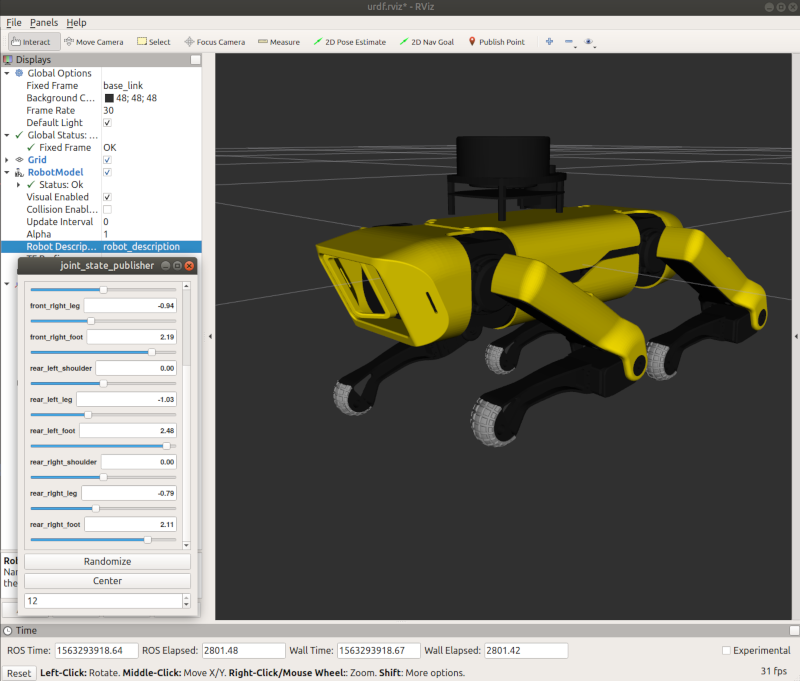

## Simulation

This section contains information on the most up-to-date simulation solutions.

### Quickstart PyBullet

I have deployed a 12-point Bezier Curve gait to make Spot walk:


This example can be found in the [Repository](https://github.com/moribots/spot_mini_mini). You can optionally use a Game Pad:
```
pip3 install numpy
pip3 install pybullet
pip3 install gym

cd spot_bullet/src

./env_tester.py
```


### Quickstart Reinforcement Learning

I trained an ARS RL agent to help Spot walk over rough terrain:


This example can be found in the [Repository](https://github.com/moribots/spot_mini_mini).
```
pip3 install numpy
pip3 install pybullet
pip3 install gym

git checkout spot_forward

cd spot_bullet/src

./spot_ars_eval.py

enter trained policy number: (e.g 149)
```

### Quickstart for ROS



There is also a first ROSification of SpotMicroAI.

First of all install ROS. I use Melodic, but it should work with Kinetic, too.
I will not go into detail on how to install ROS because there are many good Tutorials out there.

When finished installing ROS:

```
cd ~/catkin_ws/src
git clone https://github.com/FlorianWilk/SpotMicroAI.git
cd ..
catkin_make
source ./devel/setup.bash
roslaunch spotmicroai showmodel.launch
```

This will show up RVIZ with the Model of SpotMicroAI. 

### Kinematics

In order to be able to move the Robot or even make it walk, we need something which tells us what servo-angles
will be needed for a Leg to reach position XYZ.
This is what InverseKinematics does. We know all the constraints, the length of the legs, how the joints rotate and where they are positioned. 

You can find [some a first draft of the calculations here](https://github.com/FlorianWilk/SpotMicroAI/tree/master/Kinematics). There is also a [Jupyter Notebook explaining the Kinematics](https://github.com/FlorianWilk/SpotMicroAI/tree/master/Kinematics/Kinematic.ipynb) and a [YouTube-Video](https://www.youtube.com/watch?v=VSkqhFok17Q).

In this [Repository](https://github.com/moribots/spot_mini_mini), there is a working IK solver for both Spot's legs and its body:


