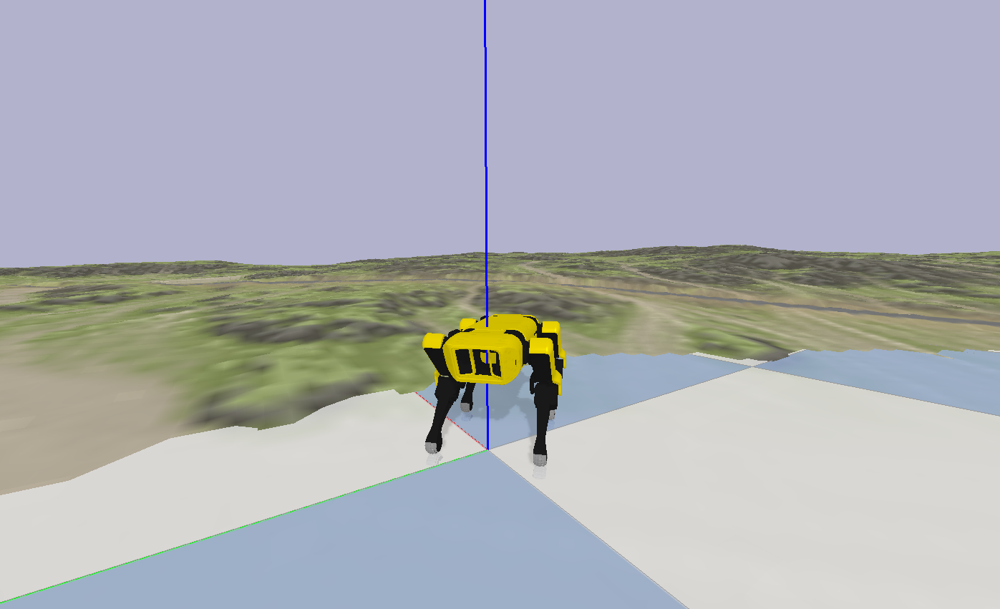
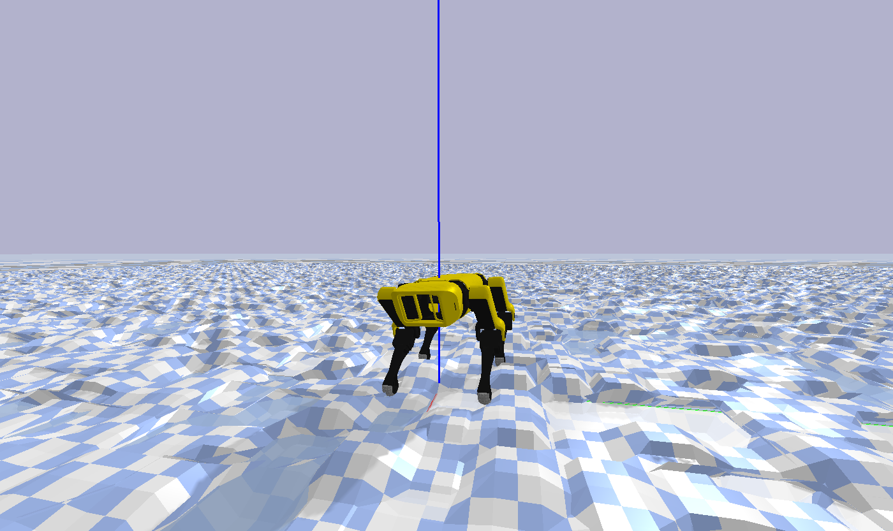

## Reinforcement Learning Environment

We now have a [Reinforcement Learning Environment](https://github.com/moribots/spot_mini_mini) which uses Pybullet and OpenAI Gym! It contains a variety of optional terrains, which can be activated using **heightfield=True** in the environment class constructor.

If you try to launch the vanilla gait on fairly difficult terrain, Spot will fall very quickly:


By training an Augmented Random Search agent, this can be overcome:


If you are new to RL, I recommend you try a simpler example. Notice that if we choose non-ideal parameters for the generated gait, the robot drifts over time with a forward command:


You should try to train a policy which outputs a yaw command to eliminate the robot's drift, like this:


You can choose a PNG-generated terrain:



Or, for more control, you can choose a programmatically generated heightfield:



Notice that when the simulation resets, the terrain changes. What you cannot see is that the robot's link masses and frictions also change under the hood:


### Quickstart Reinforcement Learning

```
pip3 install numpy
pip3 install pybullet
pip3 install gym

git checkout spot_forward

cd spot_bullet/src

./spot_ars_eval.py

enter trained policy number: (e.g 149)
```